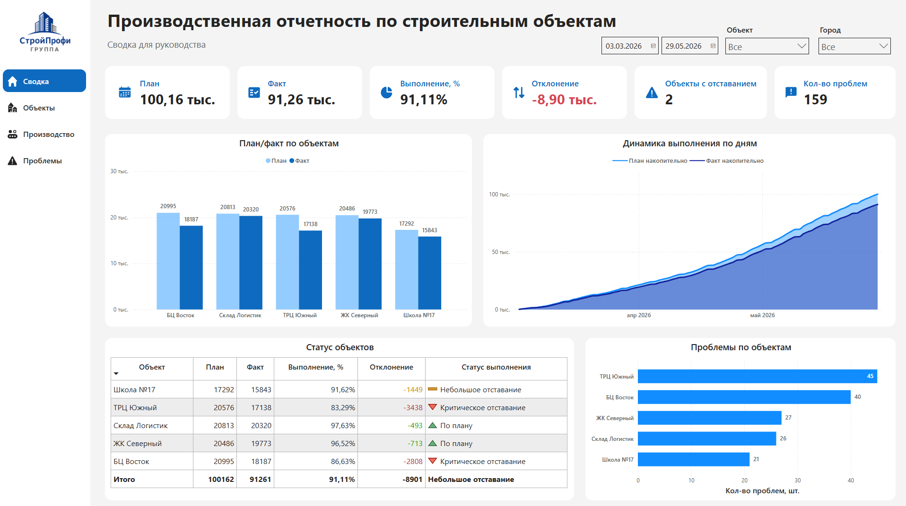
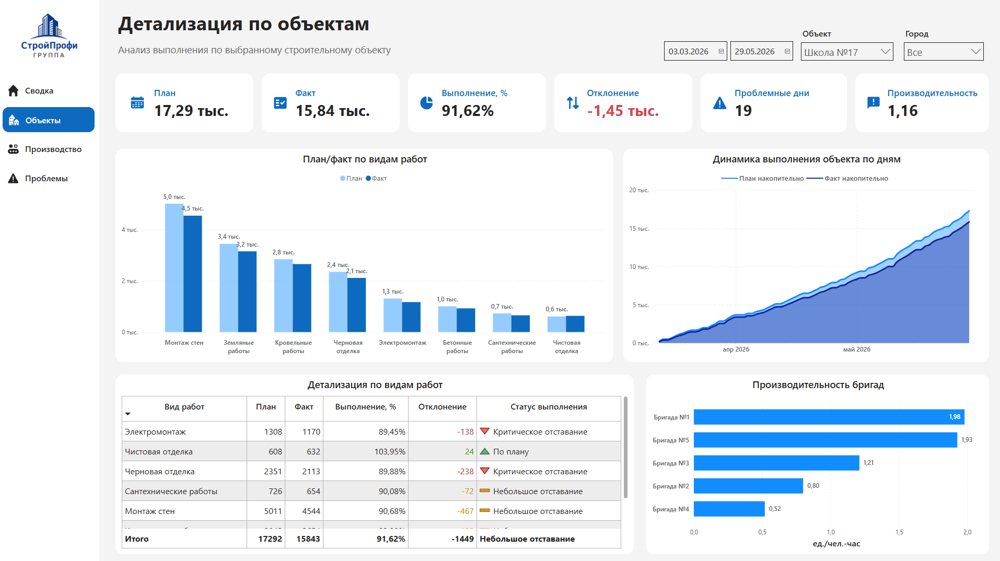
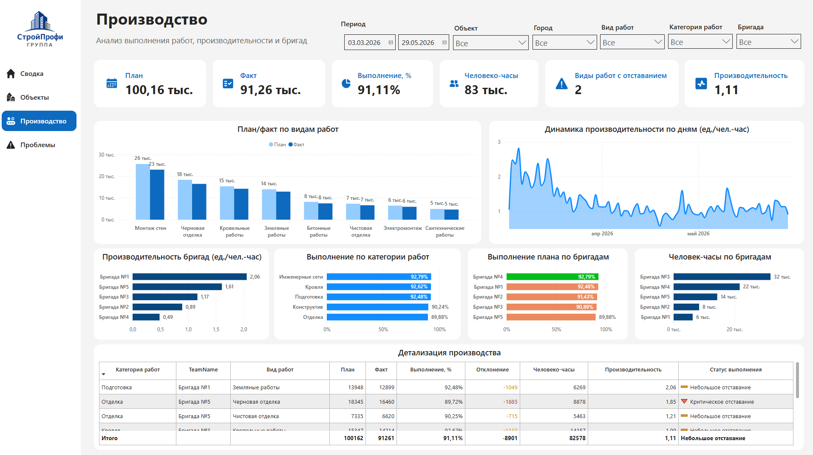
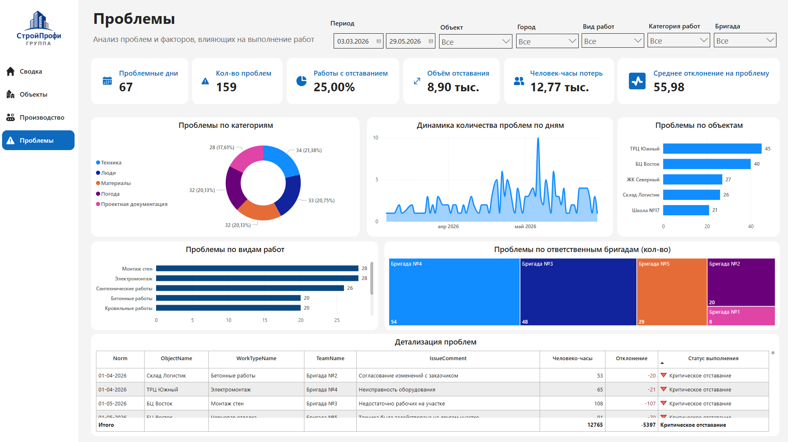

# Производственная отчётность строительных объектов

Power BI dashboard для анализа выполнения строительных работ: план/факт, отставания, производительность бригад и проблемные зоны.

## Что внутри

* анализ выполнения плана по объектам;
* сравнение планового и фактического объёма работ;
* поиск объектов и видов работ с отставанием;
* анализ производительности бригад;
* разбор проблемных дней и причин отклонений;
* модель данных и DAX-метрики.

## Скриншоты

### Сводка

### Объекты

### Производство

### Проблемы

## Инструменты

Power BI, DAX, Power Query, Excel, Data Modeling, Data Visualization, Dashboard Design.

## Файлы проекта

* `dashboard.pbix` — Power BI отчёт;
* `screenshots/` — скриншоты страниц дашборда;
* `data/` — исходные данные для анализа.
